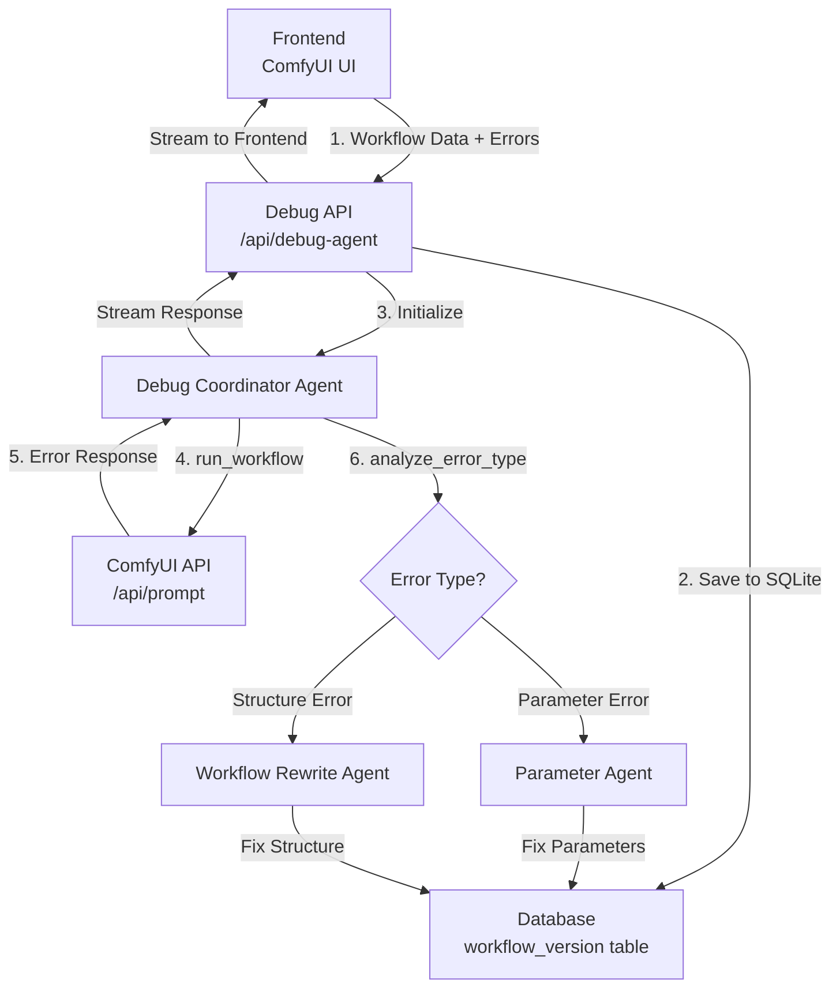

# ComfyUI Debug System

A multi-agent debugging system for ComfyUI workflows using OpenAI's agent architecture.

## Overview

The Debug System automatically analyzes and fixes errors in ComfyUI workflows using three specialized agents:

1. **Debug Coordinator Agent** - Orchestrates the debugging process
2. **Parameter Agent** - Fixes parameter-related errors (missing models, invalid values)
3. **Workflow Rewrite Agent** - Fixes structural errors (connections, missing nodes)

## Architecture



## Quick Start

### 1. Setup

```bash
# Run the setup script
python backend/setup_debug_system.py

# Edit the environment file
# Add your OpenAI API key to backend/service/.env.llm
```

### 2. Test the System

```bash
# Make sure ComfyUI is running on http://127.0.0.1:8188

# Run the test suite
python backend/test_debug_system.py
```

### 3. Use in Your Application

```python
from backend.service.debug_agent import debug_workflow_errors

async def debug_my_workflow():
    workflow_data = {
        "1": {
            "inputs": {"vae_name": "nonexistent.safetensors"},
            "class_type": "VAELoader"
        }
    }
    
    config = {
        "session_id": "my_session_123",
        "model": "gpt-4o-mini"  # or your preferred model
    }
    
    async for text, ext in debug_workflow_errors(workflow_data, config):
        print(text)  # Streaming debug output
```

## API Endpoint

### POST /api/debug-agent

Debug a ComfyUI workflow with automatic error fixing.

**Request:**
```json
{
    "session_id": "unique_session_id",
    "workflow_data": {
        "1": {
            "inputs": {"vae_name": "ae.sft"},
            "class_type": "VAELoader"
        }
    }
}
```

**Headers:**
- `Openai-Api-Key`: Your OpenAI API key
- `Openai-Base-Url`: (Optional) Custom OpenAI base URL

**Response:**
Streaming JSON responses:
```json
{
    "session_id": "unique_session_id",
    "text": "Analyzing workflow errors...",
    "finished": false,
    "type": "debug",
    "format": "markdown",
    "ext": null
}
```

## Error Types Handled

### Parameter Errors
- `value_not_in_list` - Invalid parameter value
- Missing model files (checkpoints, LoRAs, VAE, etc.)
- Invalid parameter types

The Parameter Agent will:
- Find the closest matching valid value
- Suggest model downloads with links
- Automatically update parameters when possible

### Structure Errors
- Broken node connections
- Missing required nodes
- Invalid node configurations

The Workflow Rewrite Agent will:
- Fix broken connections
- Add missing nodes
- Remove invalid nodes
- Validate the workflow structure

## Database Schema

The system stores workflow versions in SQLite:

```sql
CREATE TABLE workflow_version (
    id INTEGER PRIMARY KEY AUTOINCREMENT,
    session_id VARCHAR(255) NOT NULL,
    workflow_data TEXT NOT NULL,  -- JSON
    attributes TEXT,              -- JSON metadata
    created_at DATETIME DEFAULT CURRENT_TIMESTAMP
);
```

## Configuration

### Environment Variables (.env.llm)

```env
# Required
OPENAI_API_KEY=your-api-key-here

# Optional
OPENAI_BASE_URL=https://api.openai.com/v1
DEFAULT_MODEL=gpt-4o-mini
DATABASE_PATH=data/workflow_debug.db
```

### Supported Models

- `gpt-4o-mini` (recommended for cost efficiency)
- `gpt-4o`
- Any OpenAI-compatible model

## Development

### Adding New Tools

1. Add tool functions to the appropriate agent file
2. Decorate with `@function_tool`
3. Add to agent's tools list

Example:
```python
@function_tool
def my_new_tool(param: str) -> str:
    """Tool description"""
    return json.dumps({"result": "success"})
```

### Extending Agents

1. Create new agent in `backend/service/`
2. Define tools and instructions
3. Add to handoffs in coordinator agent

## Troubleshooting

### Common Issues

1. **Timeout errors**
   - Check ComfyUI is running
   - Verify network connectivity
   - Increase timeout in code if needed

2. **No workflow data found**
   - Check session_id is correct
   - Verify database connection

3. **Model not found errors**
   - Check model files exist in ComfyUI/models/
   - Verify file permissions

### Debug Mode

Enable detailed logging:
```python
import logging
logging.basicConfig(level=logging.DEBUG)
```

## Examples

### Example 1: Fix Missing Model

```python
# Workflow with missing VAE
workflow = {
    "1": {
        "inputs": {"vae_name": "nonexistent_vae.safetensors"},
        "class_type": "VAELoader"
    }
}

# Debug system will:
# 1. Detect missing VAE error
# 2. Suggest available VAEs or download links
# 3. Update to valid VAE if match found
```

### Example 2: Fix Broken Connection

```python
# Workflow with invalid connection
workflow = {
    "1": {
        "inputs": {
            "text": "test",
            "clip": ["99", 0]  # Node 99 doesn't exist
        },
        "class_type": "CLIPTextEncode"
    }
}

# Debug system will:
# 1. Detect broken connection
# 2. Remove invalid connection or find valid node
# 3. Update workflow structure
```

## Contributing

1. Fork the repository
2. Create feature branch
3. Add tests for new features
4. Submit pull request

## License

This project is licensed under the MIT License. 